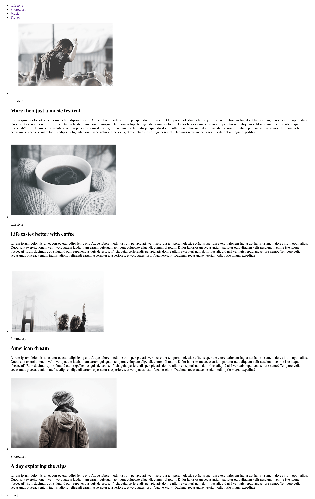

# Домашнее задание

- Создай репозиторий `goit-markup-hw-02`.
- Переведи [макет страницы](./assets/mockup.psd) в HTML-разметку, без CSS
  оформления.
- Готовые изображения возьми [тут](./assets) и сохрани в подпапке `images` в
  папке проекта.
- Весь текстовый контент абзацей замени текстом-рыбой, а остальное скопируй из
  макета.
- Настрой раздачу статики с `GitHub Pages` и добавь ссылку на живую страницу в
  шапку GitHub-репозитория.

[Онлайн аналог Photoshop](https://www.photopea.com/)

Страница готового задания будет выглядеть так, но при этом помни о семантической
разметке и используй теги по назначению, а не просто чтобы было похоже.

