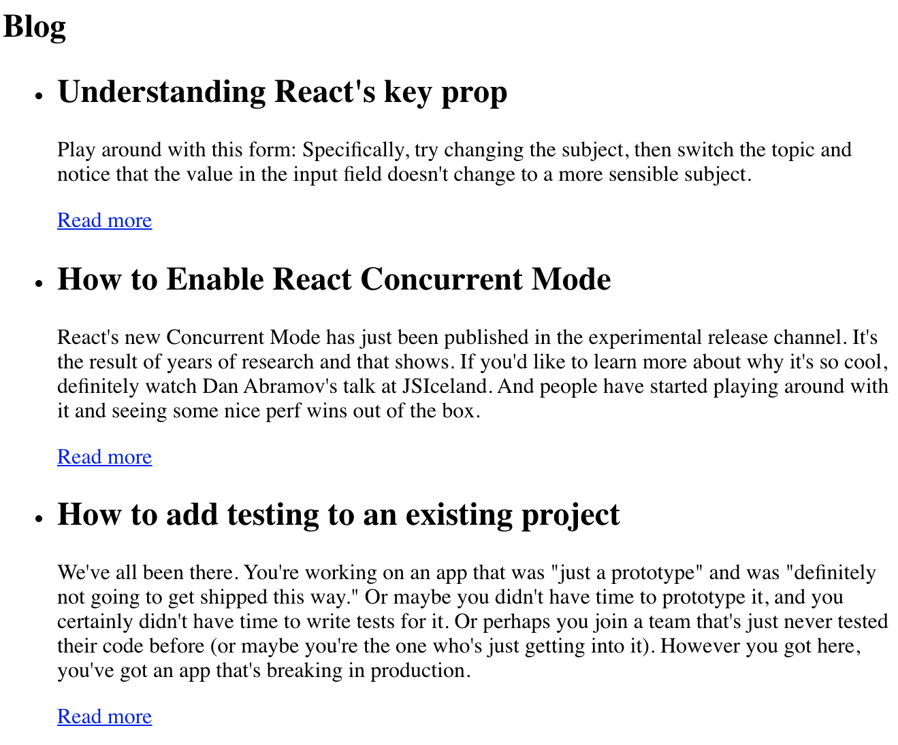

# Задание 1

Сверстай блок статьи состоящей из изображения, заголовка, абзаца и ссылки
ведущей на твой GitHub-профиль. Ширина изображения должна быть `480` пикселей.
Изображение возьми любое, а для текста можно использовать текст-рыбу.

# Задание 2

Сверстай секцию с заголовком и списком ссылок на главные страницы популярных
соцсетей. При клике на ссылку, она должна открываться в новой вкладке браузера,
а не в текущей.

# Задание 3

Сверстай секцию блога с заголовком и списком из нескольких постов. В каждом
элементе списка должен быть заголовок, абзац текста и ссылка ведущая на
`https://kentcdodds.com/blog/`. Для текста используй текст-рыбу.

# Задание 4

Сверстай разметку шапки с логотипом и меню веб-сайта
[kentcdodds.com](https://kentcdodds.com/), без CSS-оформления.

URL для ссылок:

- `https://kentcdodds.com/` - главная страница
- `https://kentcdodds.com/blog/` - страница блога
- `https://kentcdodds.com/talks/` - страница выступлений
- `https://kentcdodds.com/workshops/` - страница воркшопов
- `https://kentcdodds.com/chats-with-kent-podcast` - страница подкастов
- `https://kentcdodds.com/about/` - страница о сайте

# Задание 5

Сверстай разметку таблицы с изображения, для заголовка используй тег
`<caption>`.

# Задание 6

Сверстай разметку формы с изображения. Не забудь об атрибутах `placeholder` и
`name`.

