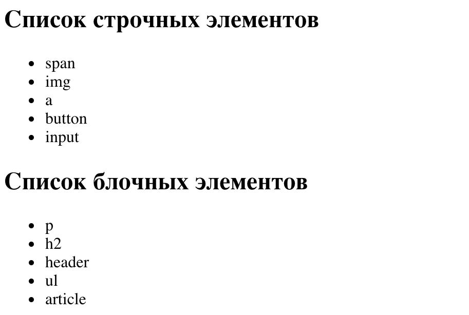
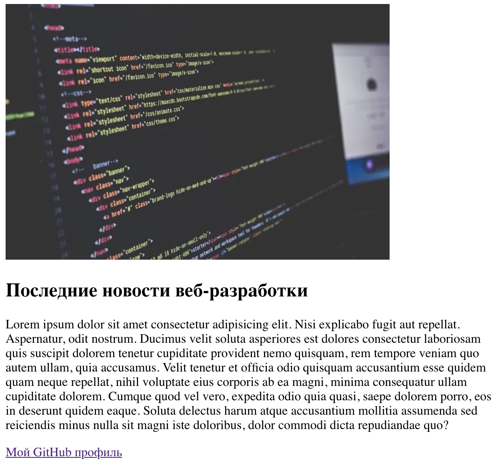
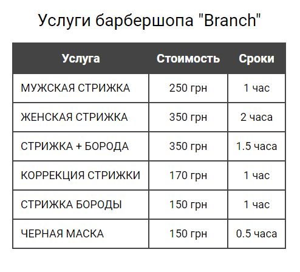

# Задание 1

Сверстай два маркированных списка по пять элементов каждый. Перед каждым списком
добавь заголовок.

- Первый должен содержать набор тегов `<li>`, внутри каждого из которых будет
  имя строчного элемента. В заголовке будет текст `Список строчных элементов`.
- Второй должен содержать набор тегов `<li>`, внутри каждого из которых будет
  имя блочного тега. В заголовке будет текст `Список блочных элементов`.

[Справочник по HTML-тегам](https://htmlreference.io/)

# Задание 2

Сверстай блок статьи состоящей из изображения, заголовка, абзаца и ссылки
ведущей на твой GitHub-профиль. Ширина изображения должна быть `480` пикселей.
Изображение возьми любое, а для текста можно использовать текст-рыбу.

# Задание 3

Сверстай секцию с заголовком и списком ссылок на главные страницы популярных
соцсетей. При клике на ссылку, она должна открываться в новой вкладке браузера,
а не в текущей.

# Задание 4

Сверстай секцию с заголовком и нумерованным списком как минимум из трех
элементов. В каждом элементе списка должен быть заголовок и абзац. Для генерации
текста используй текст-рыбу.

# Задание 5

Сверстай разметку таблицы с изображения, для заголовка используй тег
`<caption>`.

# Задание 6

Сверстай разметку формы с изображения. Не забудь об атрибутах `placeholder` и
`name`.

