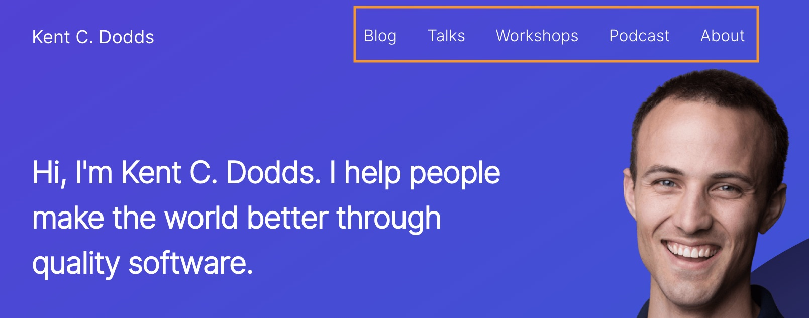
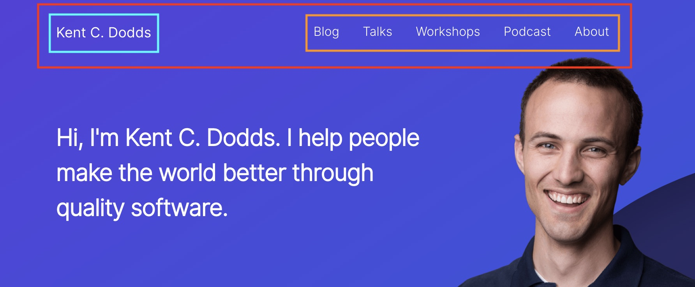
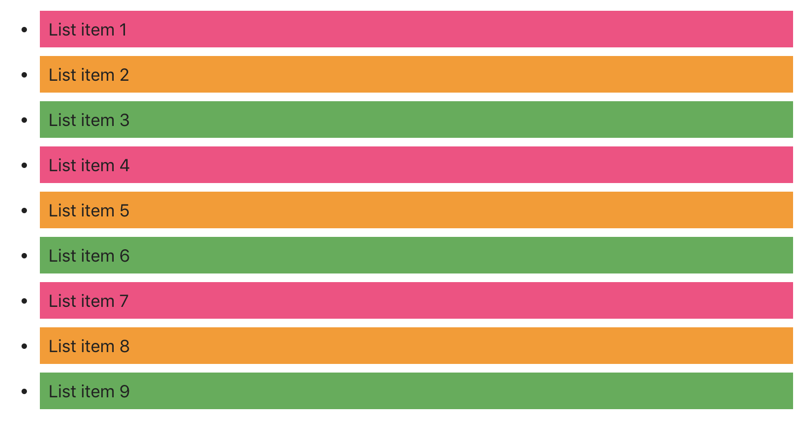

# Задание 1

Сверстай список из 5-ти элементов. Добавь всем элементам списка, кроме первого,
верхний margin в `16px`.

```html
<ul class="list">
  <li class="list-item">List item 1</li>
  <li class="list-item">List item 2</li>
  <li class="list-item">List item 3</li>
  <li class="list-item">List item 4</li>
  <li class="list-item">List item 5</li>
</ul>
```

# Задание 2

Сверстай горизонтальное меню.

- Разметка и базовые стили у тебя уже есть из предыдущих заданий.
- Для расположения элементов используй Flexbox.
- У каждого элемента меню, кроме крайнего левого (первого), должен быть левый
  margin в `12px`.
- У каждой ссылки должен быть вертикальный padding в `12px` и горизонтальный в
  `20px`.



# Задание 3

Сверстай шапку сайта.

- Разметка и базовые стили у тебя уже есть из предыдущих заданий.
- Для расположения элементов используй Flexbox.
- Добавь в шапку `div.container` с шириной `960px` и горизонтальным padding
  `24px`. Логотии и меню будут в контейнере. Контейнер должен быть горизонтально
  центрирован внутри шапки.



# Задание 4

Сверстай список из девяти элементов. С помощью псевдокласса `:nth-child()`,
добавь элементам списка три чередующихся цвета фона `#ff4081`, `#ff9800` и
`#4caf50`.

```html
<ul class="list">
  <li class="list-item">List item 1</li>
  <li class="list-item">List item 2</li>
  <li class="list-item">List item 3</li>
  <li class="list-item">List item 4</li>
  <li class="list-item">List item 5</li>
  <li class="list-item">List item 6</li>
  <li class="list-item">List item 7</li>
  <li class="list-item">List item 8</li>
  <li class="list-item">List item 9</li>
</ul>
```

[Генератор селекторов псевдокласса](https://wp-kama.ru/wp-content/uploads/2015/06/nth-child-posobie.html)

В браузере должно получиться вот так.


