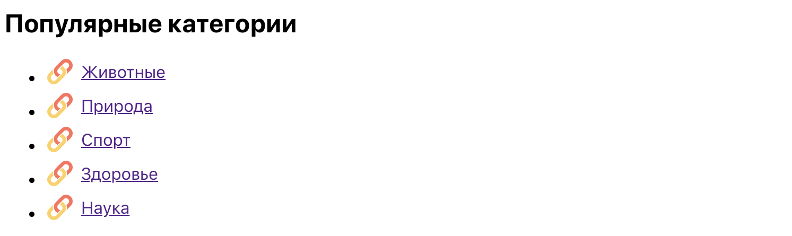
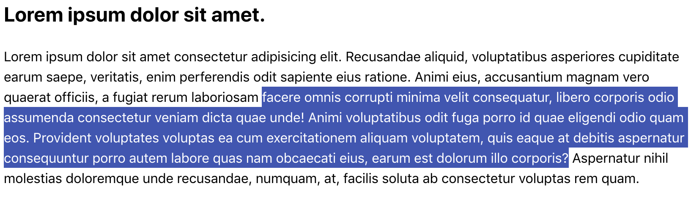
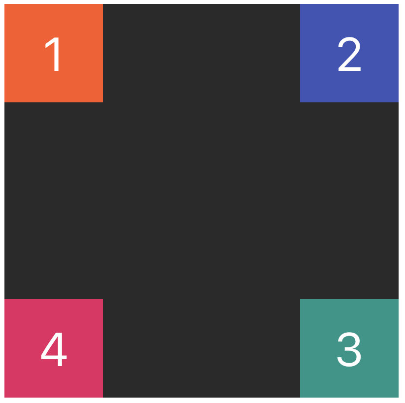

# Задание 1

Используй готовую разметку секции с заголовком и списком. C помощью
псевдоэлемента `::before` добавь в каждую ссылку
[эту иконку](./assets/task-01-icon.svg) перед текстом. Не меняй классы или
разметку.

```html
<section>
  <h2>Популярные категории</h2>

  <ul class="categories">
    <li class="item">
      <a href="#" class="link">Животные</a>
    </li>
    <li class="item">
      <a href="#" class="link">Природа</a>
    </li>
    <li class="item">
      <a href="#" class="link">Спорт</a>
    </li>
    <li class="item">
      <a href="#" class="link">Здоровье</a>
    </li>
    <li class="item">
      <a href="#" class="link">Наука</a>
    </li>
  </ul>
</section>
```

В результате получится вот так.



# Задание 2

Сверстай статью с заголовком и абзацем текста. Добавь стили так, чтобы при
выделении любого текста, цвет фона и текста отличался от стандартного.

- `#3f51b5` - цвет фона выделения
- `#ffffff` - цвет текста выделения



# Задание 3

Сверстай блок размером на всю страницу, поставь на фон
[это изображение](./assets/task-03-image.jpg). Используя технику множественного
фона добавь поверх картинки одноцветный линейный градиент с прозрачностью
`rgba(0, 0, 0, 0.3)`.

# Задание 4

Сверстай `div.container` размером `400x400` пикселей и фоном `#2a2a2a`. Добавь в
него еще четыре `div.box` произвольных (но разных) цветов, каждый размером
`100x100` пикселей. Используя абсолютное позиционирование, расположи блоки
относительно родителя как на изображении.

```html
<div class="container">
  <div class="box">1</div>
  <div class="box">2</div>
  <div class="box">3</div>
  <div class="box">4</div>
</div>
```


