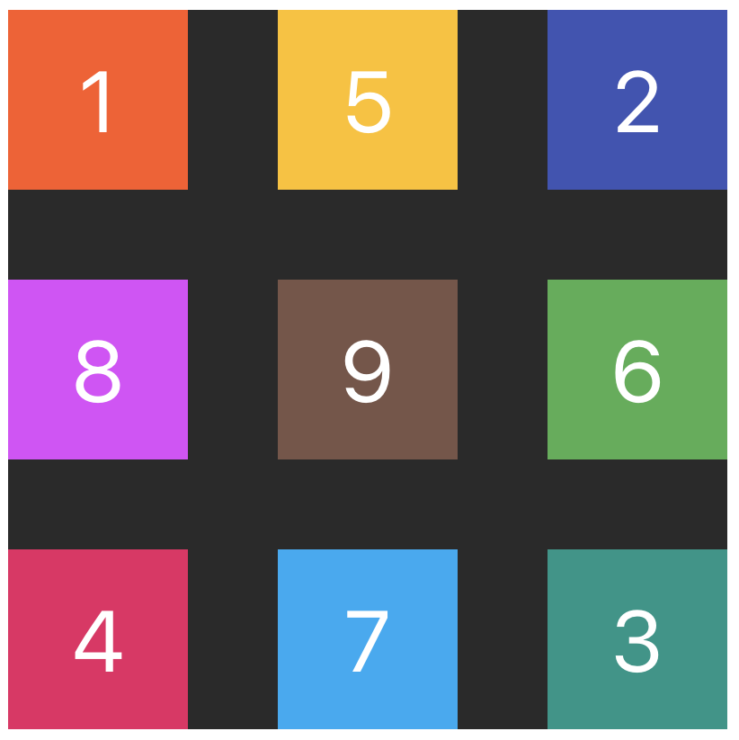

# Задание 1

Сверстай `<div>` размером `400x400` пикселей и фоном `#424242`. Добавь в него
еще девять `<div>` произвольных (но разных) цветов, каждый размером `100x100`
пикселей. Используя абсолютное позиционирование и трансформации, расположи блоки
относительно родителя как на изображении.

```html
<div class="container">
  <div class="box">1</div>
  <div class="box">2</div>
  <div class="box">3</div>
  <div class="box">4</div>
  <div class="box">5</div>
  <div class="box">6</div>
  <div class="box">7</div>
  <div class="box">8</div>
  <div class="box">9</div>
</div>
```



# Задание 2

Сверстай кнопку и добавь эффект изменения цвета фона при наведении. Используя
CSS-переходы сделай так, чтобы цвет фона изменялся за `250ms`.

- `#ffffff` - цвет текста кнопки
- `#1976d2` - цвет фона по умолчанию
- `#115293` - цвет фона при ховере


# Задание 3

Сверстай и добавь оформление карточки для онлайн галереи со следующей разметкой.

```html
<section class="card">
  

  <div class="overlay">
    <h2 class="name">Colors of the world</h2>
    <p class="about">
      Lorem ipsum dolor sit amet consect, adipisicing elit. Ipsa earum minima
      alias quaerat obcaecati ad totam facilis, architecto repudiandae vero
      tenetur delectus harum, inventore eum magni, hic sed. Ad, tempore!
    </p>
  </div>
</section>
```

Добавь эффект появления `section.overlay` за `250ms` при ховере как на изображении.


