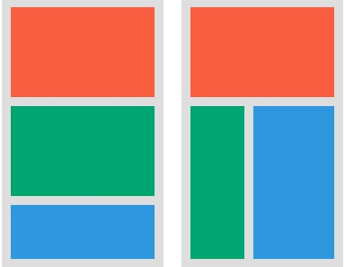
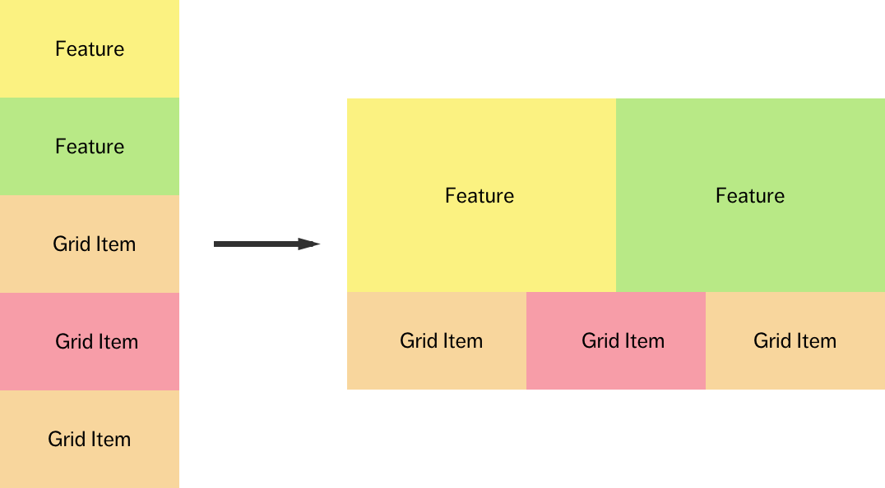

# Задание 1

Используя медиаправила повтори расположение блоков на изображении для такой
разметки.

```html
<div class="container">
  <div class="content"></div>
  <div class="sidebar"></div>
</div>
```

- `до 767px` - левая фигура
- `от 768px и шире` - правая фигура


# Задание 2

Используя медиаправила повтори расположение блоков на изображении для такой
разметки.

```html
<div class="container">
  <div class="content"></div>
  <div class="sidebar"></div>
</div>
```

- `до 479px` - блоков `div.content` и `div.sidebar` не видно
- `от 480px до 767px` - левая фигура
- `от 768px и шире` - правая фигура


# Задание 3

Используя медиаправила повтори расположение блоков на изображении для такой
разметки.

- `до 767px` - левая фигура
- `от 768px и шире` - правая фигура

```html
<div class="container">
  <div class="red"></div>

  <div class="wrapper">
    <div class="green"></div>
    <div class="blue"></div>
  </div>
</div>
```



# Задание 4

Используя медиаправила повтори расположение блоков на изображении для такой
разметки.

- `до 479px` - секции `section.features` не видно и левая фигура
- `от 480px до 767px` - левая фигура
- `от 768px и шире` - правая фигура

```html
<div class="container">
  <section class="features">
    <div class="feature">Feature</div>
    <div class="feature">Feature</div>
  </section>

  <section class="items">
    <div class="item">Item</div>
    <div class="item">Item</div>
    <div class="item">Item</div>
  </div>
</div>
```


